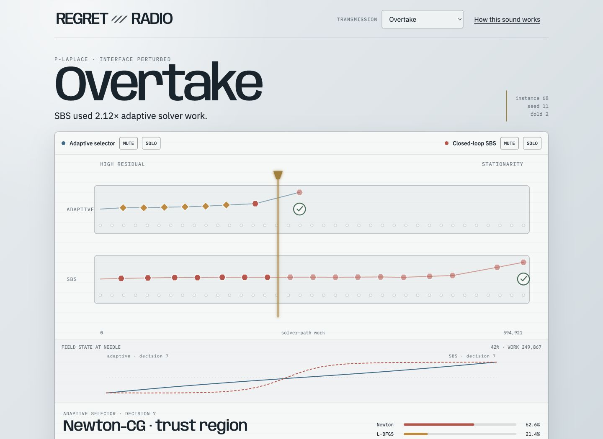

# Regret Radio

[](https://github.com/EzraCerpac/regret-radio/actions/workflows/ci.yml)

Regret Radio is a static scientific web toy: two accepted optimization traces
share one solver-work timeline, while a deterministic synthesizer turns each
recorded decision into sound. It compares a one-switch-trained adaptive selector
with closed-loop SBS. The radio metaphor is presentation, not a new metric.



## Thesis context

Regret Radio grew out of my master's thesis, *Adaptive Solver Selection for
Nonlinear Problems using Deep Learning*, in Scientific Computing at TU Berlin.
The thesis asks whether a learned selector can choose among optimization
methods while solving nonlinear energy-minimization problems, using the current
numerical state instead of committing to one solver for the whole trajectory.

The adaptive lane is trained from a one-switch counterfactual target: an
initial solver action is valued together with a fixed-action continuation.
“One-switch-trained” describes that training signal, not a restriction on the
selector at runtime. In these tracks the selector runs closed loop and is
compared with a closed-loop single-best-solver baseline. Horizontal position
measures recorded solver-path work, not wall-clock time.

## Run it

```sh
bun install
bun run dev
```

Nothing is fetched at runtime. `bun run build` produces a standalone `dist/`.

## Evidence

The six bundled stories were exported from accepted closed-loop study
`d8216a1028b7ba60bd8a6d3846ac6d74c146ffac18e7e6517da620e9f256a8d4`.
The fixture contains only the public Regret Radio JSON contract: no absolute
source paths and no thesis application code.

The Transmission Index displays every loaded curated evidence story, including
validated local imports, using only family, start kind, convergence,
solver-path work, and recorded action switches. It is a catalog of selected
stories, not a representative statistical population, ranking, or new metric.

Regenerate or byte-verify the bundle:

```sh
bun run fixture:export
bun run fixture:verify
```

The exporter accepts `--study-dir`, `--selection`, and `--output`. Its isolated
Julia project uses only JLD2 and JSON3. Browser imports accept this exported JSON
format only, with digest, schema, numeric, monotonic-work, and size checks.

## Checks

```sh
bun run check
```

This runs TypeScript, unit tests, a production build, browser interaction tests,
and deterministic evidence verification.

GitHub Actions runs the public, self-contained subset with `bun run ci`. The
raw thesis evidence is intentionally absent from the repository, so the
build-time Julia re-export check remains local.
